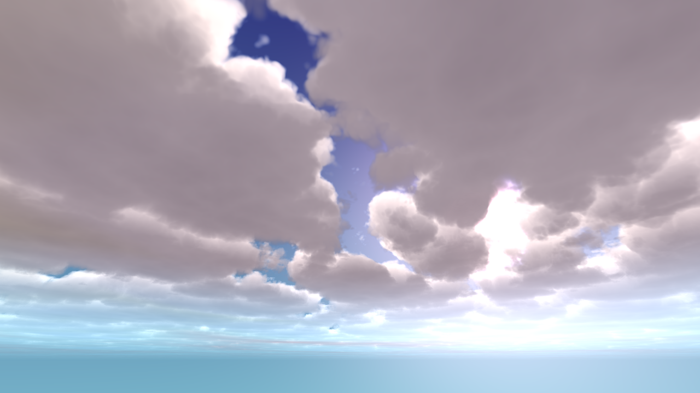
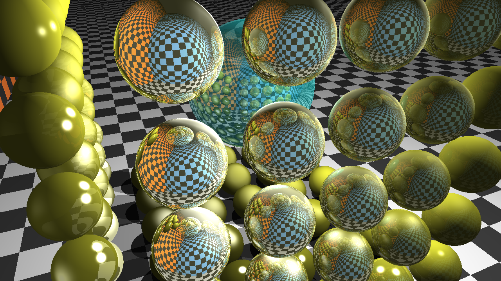
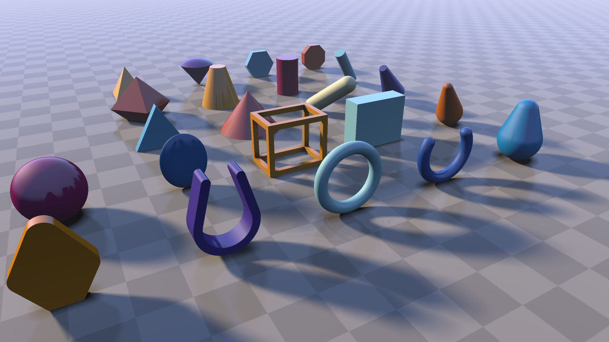
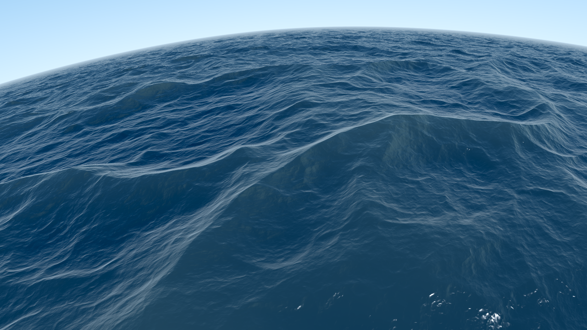
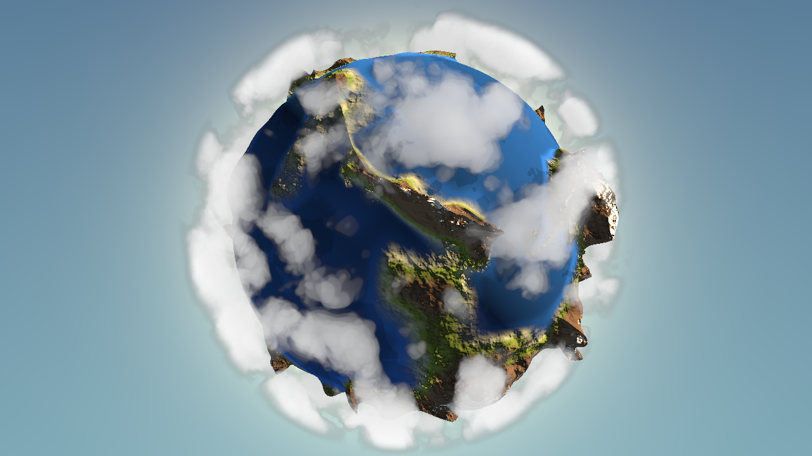

# LOCALSDTOY
LOCALSDTOY

Local Shadertoy Renderer using WebGL 2.0

Main Page URL : 
https://disini.github.io/LOCALSDTOY/

Demo Lists : 

[BeautyClouds](https://disini.github.io/LOCALSDTOY/WebglTest.html?BeautyClouds "BeautyClouds")

[Cook-Torrance](https://disini.github.io/LOCALSDTOY/WebglTest.html?Cook-Torrance "Cook-Torrance")

[happyJumping](https://disini.github.io/LOCALSDTOY/WebglTest.html?happyJumping "happyJumping")

[PlanetShadertoy](https://disini.github.io/LOCALSDTOY/WebglTest.html?PlanetShadertoy "PlanetShadertoy")

[ProteanClouds](https://disini.github.io/LOCALSDTOY/WebglTest.html?ProteanClouds "ProteanClouds")

[RaymarchingMirror](https://disini.github.io/LOCALSDTOY/WebglTest.html?RaymarchingMirror "RaymarchingMirror")

[raymarchingPrimitives](https://disini.github.io/LOCALSDTOY/WebglTest.html?raymarchingPrimitives "raymarchingPrimitives")

[seascape](https://disini.github.io/LOCALSDTOY/WebglTest.html?seascape "seascape")

[SnowMountain](https://disini.github.io/LOCALSDTOY/WebglTest.html?SnowMountain "SnowMountain")

[TinyPlanetClouds](https://disini.github.io/LOCALSDTOY/WebglTest.html?TinyPlanetClouds "TinyPlanetClouds")

[WetStone](https://disini.github.io/LOCALSDTOY/WebglTest.html?WetStone "WetStone")

